# 🏗️ Architecture Diagrams for Presentation

## System Architecture Overview


## User Workflow Diagram


## Database Schema Diagram


## AI Processing Pipeline


## Technology Stack Overview

```mermaid
mindmap
  root((Entretien Automatisé))
    Backend
      Flask
        Routes
        Controllers
        Middleware
      SQLAlchemy
        ORM
        Migrations
        Query Builder
      PostgreSQL
        Tables
        Relationships
        Indexes
    Frontend
      HTML5
        Semantic
        Accessible
      CSS3
        Responsive
        Modern
      JavaScript
        ES6+
        Async/Await
        DOM Manipulation
    AI Integration
      Google Gemini
        CV Analysis
        Question Generation
        Answer Evaluation
      OpenRouter
        Fallback API
        Multi-model
      FAISS
        Vector Search
        Similarity Matching
    DevOps
      Git
        Version Control
        Branching
      Docker
        Containerization
        Environment
      Testing
        Unit Tests
        Integration
        E2E
```



## Security Architecture


## Performance Metrics Dashboard


## Deployment Architecture


## API Architecture


## Future Roadmap


## Code Quality Metrics


## User Journey Map


## Risk Assessment Matrix


## Technology Radar

```mermaid
radar
    title Technology Adoption
    axes Python, Flask, PostgreSQL, AI/ML, React, Docker, Kubernetes, GraphQL
    axis Python : 5
    axis Flask : 4
    axis PostgreSQL : 4
    axis AI/ML : 5
    axis React : 2
    axis Docker : 3
    axis Kubernetes : 1
    axis GraphQL : 1
```

## Cost-Benefit Analysis

```mermaid
bar
    title Cost-Benefit Analysis (6 months)
    x-axis Development, Maintenance, AI APIs, Infrastructure, Training
    y-axis Cost (€)
    bar Development : 15000
    bar Maintenance : 3000
    bar AI APIs : 2000
    bar Infrastructure : 1000
    bar Training : 500

    bar Benefits : 25000
    bar Time Savings : 18000
    bar Quality Improvement : 12000
    bar User Satisfaction : 8000
    bar Competitive Advantage : 15000
```

## Performance Benchmarks


---

## 📊 Presentation Tips

### For Technical Audience:
1. **Focus on Architecture** - Show system design decisions
2. **Explain Trade-offs** - Why certain technologies were chosen
3. **Demonstrate Code Quality** - Show best practices implemented
4. **Highlight Scalability** - How the system can grow
5. **Discuss Performance** - Metrics and optimization techniques

### Visual Best Practices:
1. **Use Consistent Colors** - Black/white theme throughout
2. **Include Code Snippets** - Show actual implementation
3. **Add Architecture Diagrams** - Visual system representation
4. **Include Screenshots** - Real application interfaces
5. **Use Icons Consistently** - Professional iconography

### Content Structure:
1. **Start with Problem** - Why this project exists
2. **Show Solution** - How the system addresses the problem
3. **Dive Deep** - Technical implementation details
4. **Demonstrate Value** - Business and technical benefits
5. **End with Future** - Roadmap and improvements

---

**These diagrams provide visual representations of your system architecture, workflows, and technical decisions. Use them in your PDF presentation to make complex concepts more understandable for your technical audience.**